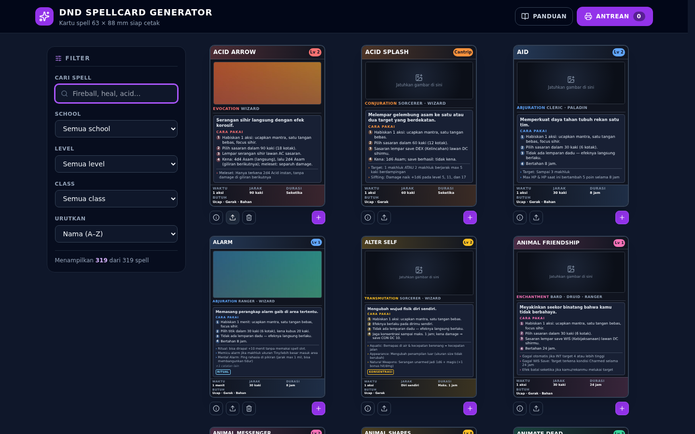
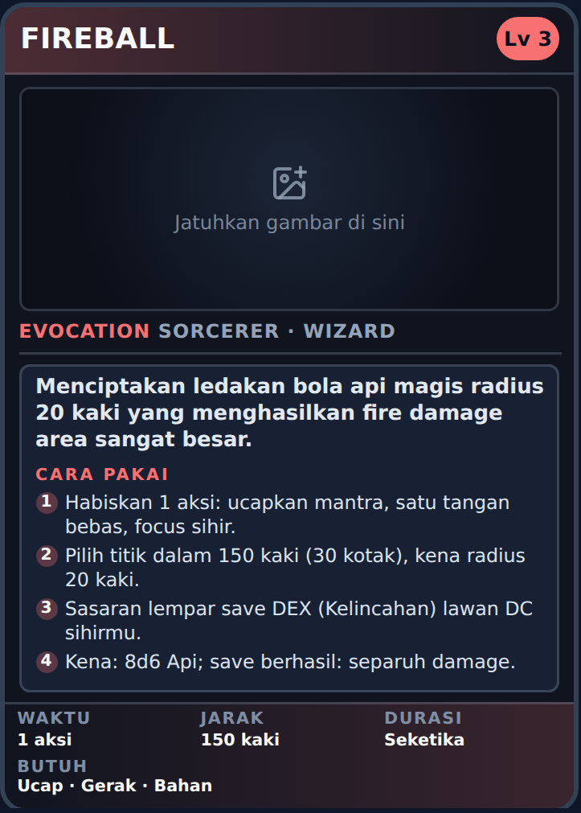
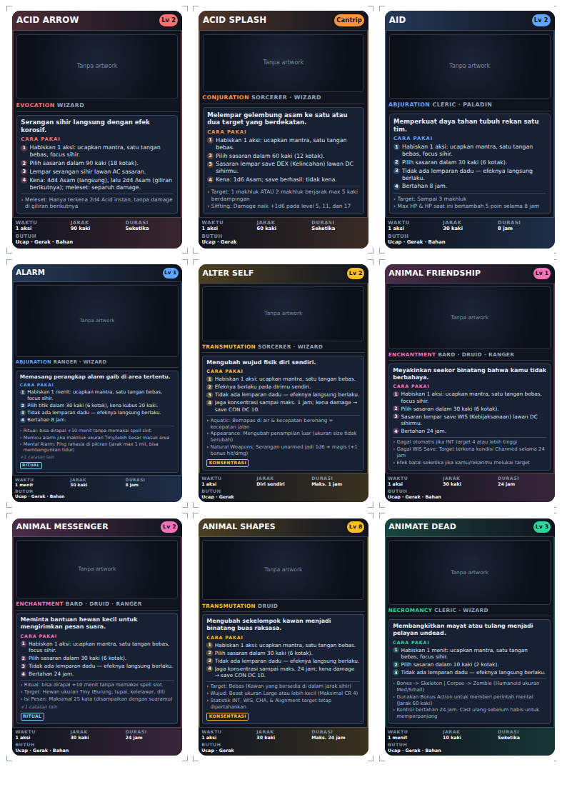
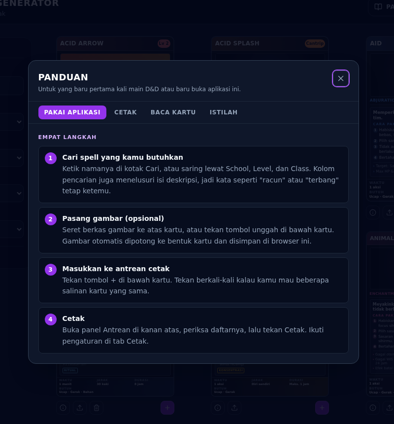

# DnD Spellcard Generator

[](https://github.com/yosaarya/card-app-dnd-indo/actions/workflows/ci.yml)
[](LICENSE)

**[Coba langsung →](https://yosaarya.github.io/card-app-dnd-indo/)**

Membuat dan mencetak kartu spell D&D 5e berukuran kartu permainan standar
**63 × 88 mm**, dengan artwork sendiri dan keterangan berbahasa Indonesia yang
bisa langsung dipakai pemain yang baru belajar.

Masalahnya sederhana: pemain baru harus bolak-balik membuka buku aturan
berbahasa Inggris hanya untuk tahu "sekarang saya lempar dadu apa?". Aplikasi
ini memindahkan jawaban itu ke selembar kartu yang bisa dipegang di meja.



## Yang membuatnya berbeda dari daftar spell biasa



Setiap kartu memuat **langkah "cara pakai"** — bukan salinan deskripsi resmi,
melainkan urutan yang benar-benar dilakukan pemain di meja:

1. Habiskan 1 aksi: ucapkan mantra, satu tangan bebas, focus sihir.
2. Pilih titik dalam 150 kaki (30 kotak), kena radius 20 kaki.
3. Sasaran lempar save DEX (Kelincahan) lawan DC sihirmu.
4. Kena: 8d6 Api; save berhasil: separuh damage.

Langkah itu **diturunkan dari data**, bukan ditulis satu per satu untuk 319
spell. Jarak selalu disertai jumlah kotak peta (1 kotak = 5 kaki), karena
itulah satuan yang dipakai saat bermain.

<br clear="right">

## Tiga masalah teknis yang menarik

### 1. Layar dan kertas harus benar-benar sama

Versi awal menggambar kartu cetak dengan ukuran piksel layar. Tiga kolom
× 240 px melebihi lebar cetak A4, jadi kolom ketiga terpotong — dan tidak ada
yang menyadarinya sampai kertasnya keluar dari printer.

Sekarang kartu layar dan kartu kertas memakai komponen React dan CSS yang
sama persis. Yang berbeda hanya satu variabel:

```css
.sc-card {
  --sc-unit: 10px;
} /* layar: kartu 240 px */
.print-page .sc-card {
  --sc-unit: 2.625mm;
} /* kertas: kartu 63 mm */
```

Semua ukuran di dalam kartu ditulis dalam `em` terhadap `--sc-unit`. Karena
240 px : 10 px = 63 mm : 2,625 mm, proporsinya identik — pratinjau di layar
adalah hasil cetaknya.

### 2. Satu ukuran font tidak mungkin muat untuk 319 kartu

Panjang keterangan antar spell berbeda jauh: ada yang tiga langkah pendek,
ada yang lima langkah plus empat catatan. Pada ukuran font tetap, **317 dari
319 kartu isinya terpotong.**

`src/lib/fitCards.js` mengukurnya langsung dari DOM lalu menurunkan pengali
`--sc-fit` bertahap sampai muat. Bagian yang penting adalah urutannya:

```js
for (const scale of LADDER) {
  // semua penulisan gaya dulu…
  for (const card of pending) card.style.setProperty('--sc-fit', String(scale));

  // …baru semua pembacaan, jadi browser menghitung tata letak
  // sekali per putaran, bukan sekali per kartu
  pending = pending.filter((card) => {
    /* cek luapan */
  });
}
```

Menulis dan membaca bergantian per kartu akan memaksa ~1.900 perhitungan
tata letak. Dengan pemisahan ini jumlahnya tetap 8, berapa pun kartunya.
Karena yang disetel adalah pengali dan bukan ukuran mutlak, hasil pengukuran
di layar tetap berlaku saat kartunya dicetak 63 mm.

### 3. Elemen `display:none` tidak bisa diukur

Lembar cetak semula disembunyikan dengan `display: none`. Elemen seperti itu
tidak punya tata letak, sehingga `scrollHeight` dan `clientHeight` keduanya 0
— pengukuran di atas menganggap semua kartu muat, lalu seluruhnya meluap saat
dicetak. Lembar cetak kini dipindahkan ke luar viewport dengan
`position: fixed; left: -20000px`, jadi tetap punya tata letak.

## Hasil cetak

Satu halaman A4 memuat 3 × 3 kartu berukuran tepat 63 × 88 mm — muat di card
sleeve biasa — lengkap dengan tanda potong di keempat sudutnya.



## Bahasa Indonesia yang bisa dipakai bermain

Waktu merapal, durasi, jarak, komponen, jenis damage, penyembuhan, dan bentuk
area diterjemahkan penuh. Kosakatanya tertutup (9 casting time, 20 durasi,
17 range, 6 kombinasi komponen), jadi dipetakan satu per satu — dan ada tes
yang memastikan tidak ada satu pun dari 319 spell yang lolos tanpa
terjemahan.

Yang **sengaja dibiarkan bahasa Inggris**: nama school, nama class, dan
istilah baku seperti `Save`, `DEX`, `Charmed`, `Disadvantage`. Itulah yang
tertulis di lembar karakter dan stat block monster, jadi menerjemahkannya
justru menyulitkan pemain saat bermain. Semuanya dijelaskan di glosarium
panduan.



## Menjalankan

```bash
npm install
npm run dev          # server pengembangan
npm run build        # bundel produksi ke dist/
npm run preview      # meninjau hasil build

npm test             # 88 tes unit
npm run lint
npm run format
```

Butuh Node.js 20.19+ atau 22.12+.

### Mencetak

Buka panel **Antrean**, tekan _Cetak_, lalu di dialog cetak browser:

| Pengaturan          | Nilai                     |
| ------------------- | ------------------------- |
| Ukuran kertas       | A4, Portrait              |
| Margin              | None / 0                  |
| Background graphics | dicentang                 |
| Scale               | 100%, bukan "Fit to page" |

Panduan lengkapnya juga tersedia di dalam aplikasi lewat tombol **Panduan**.

## Struktur

```
src/
  App.jsx                 komposisi state aplikasi
  components/
    SpellCard.jsx         satu kartu TCG; dipakai layar maupun cetak
    SpellTile.jsx         kartu + kontrol di grid
    FilterPanel.jsx       pencarian dan filter
    PrintQueue.jsx        panel antrean cetak
    PrintSheet.jsx        paginasi antrean menjadi halaman A4
    SpellDetailDialog.jsx keterangan lengkap satu spell
    GuideDialog.jsx       panduan aplikasi, cetak, dan glosarium
    Toast.jsx             notifikasi singkat
  hooks/
    useFitCards.js        memicu pengukuran ulang saat daftar berubah
  lib/
    spells.js             normalisasi data, filter, urutan
    howto.js              menyusun langkah "cara pakai" dari data spell
    id.js                 pengalihbahasaan istilah D&D ke Indonesia
    fitCards.js           menurunkan ukuran teks kartu sampai isinya muat
    storage.js            localStorage yang tahan gagal
    image.js              pemotongan & kompresi artwork
    schools.js            warna aksen per school
    __tests__/            88 tes unit untuk seluruh modul di atas
  styles/card.css         bingkai kartu (dipakai layar & cetak)
  print.css               lembar A4 dan tanda potong
  data/
    spells-raw.json       hasil unduhan dnd5eapi.co
    spells-card.json      data siap kartu (dipakai aplikasi)
scripts/
  fetch-spells.js         mengunduh ulang spells-raw.json
  generate-card-data.py   menurunkan spells-card.json dari spells-raw.json
```

## Memperbarui data spell

```bash
npm run data:fetch    # unduh ulang dari dnd5eapi.co -> src/data/spells-raw.json
npm run data:cards    # turunkan ringkasan kartu -> src/data/spells-card.json
```

`data:cards` membutuhkan Python 3.

## Keputusan dan batasannya

- **Artwork disimpan di `localStorage`**, jadi hanya ada di perangkat yang
  dipakai. Gambar dipotong ke rasio kartu dan dikompres dulu (contoh: PNG
  111 KB menjadi JPEG 14 KB). Kalau kuota browser habis, aplikasi memberi
  tahu dan artwork itu hanya bertahan sampai halaman ditutup — tidak gagal
  diam-diam.
- **Seluruh 319 kartu dirender sekaligus**, tanpa virtualisasi. Waktu sampai
  bisa dipakai ~1,1 detik pada mesin uji, jadi kerumitan virtualisasi belum
  sepadan. Kalau jumlah spell bertambah beberapa kali lipat, ini bagian
  pertama yang perlu diganti.
- **Deskripsi resmi SRD masih bahasa Inggris** di dialog detail, ditandai
  sebagai teks asli. Semua keterangan yang dipakai saat bermain sudah
  berbahasa Indonesia, jadi tidak ada yang perlu dibaca dari situ untuk main.
- **Ringkasan berbahasa Indonesia di `spells-card.json`** diturunkan oleh
  `scripts/generate-card-data.py`, sebagian lewat pencocokan pola pada
  deskripsi dan sebagian lewat penulisan manual di dalam skrip itu.

## Lisensi

Kode sumber: [MIT](LICENSE).

Konten spell diturunkan dari SRD 5.1 milik Wizards of the Coast LLC di bawah
lisensi [CC-BY-4.0](https://creativecommons.org/licenses/by/4.0/legalcode),
diambil melalui [dnd5eapi.co](https://www.dnd5eapi.co). Dungeons & Dragons
dan D&D adalah merek dagang Wizards of the Coast. Proyek ini tidak berafiliasi
dengan dan tidak didukung oleh Wizards of the Coast.
